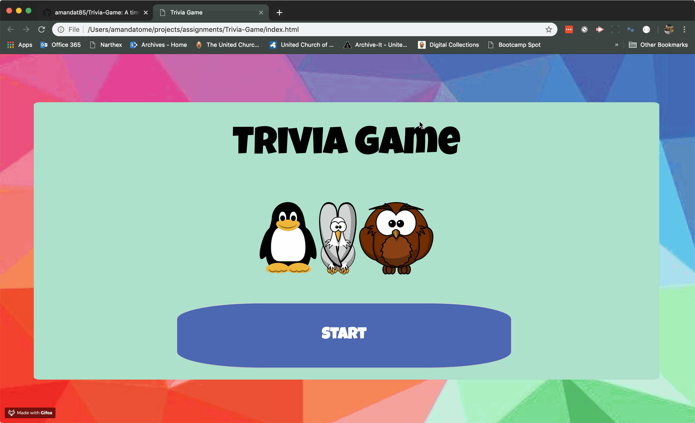

# Trivia-Game
A timed Trivia Game based on JavaScript and jQuery.

## Site
https://amandat85.github.io/Trivia-Game/

## Languages and Tools Used
* HTML
* Javascript
* jQuery
* CSS
* Google Fonts
* Media Queries

## Rules
* Players have 10 seconds to answer a multiple choice question.
* There are 10 questions in total.
* If the time runs out, the game will move on to the next question.
* If the player guesses wrong, then the correct answer will be displayed.
* At the end of the game, the player will receive total answers correct, incorrect and not answered.

## Animated Gif

